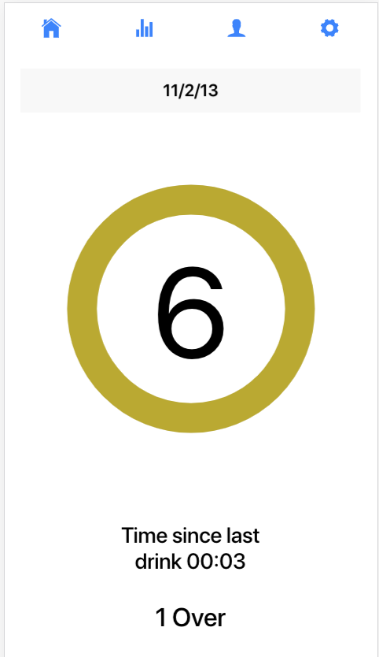
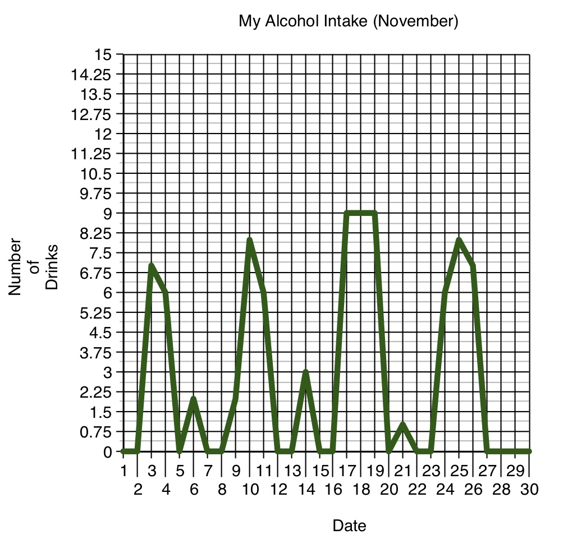
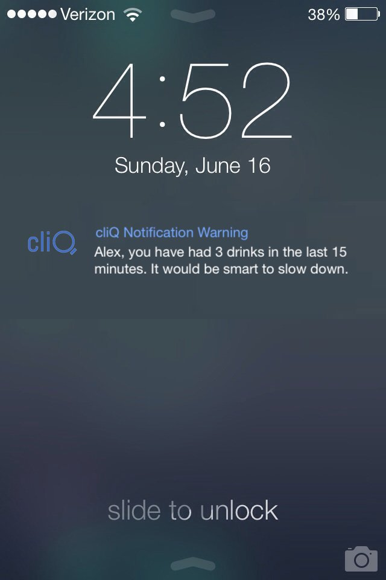

# cliQ - Application support

An application built with Ionic to support a physical device. The idea was to create technological support for a smart-wristband which would allow users to track the number of drinks they had a given night. The application would intake this data, and alert the user whether they had exceeded a recommended amount, whether they had too many drinks in too short a time, etc. The application would record aggregate data and the user would be able to see trends of their drinking behavior.

The application has support to intake profile information, and allow the user to login. There is an interface for the user to see the recommended number of drinks, but also set their own goals. The main window of the program is a visual counter which increments every time the user presses the button on their wrist-band. Further, the application has the pages for Settings, and visualizing charts for the data it will have recorded.

Some features we implemented or envisioned:

Sample screen:

A sample graph which would reflect data for a longer period of time:

Notification feature:

The idea was to help people who are trying to implement steps to be more health conscious who want to focus on their physical health by purchasing an affordable, simple to use wristband. Based on initial market research on wearable technologies, we predict that such a product would sell very well, given the predicted expansion and development of this area. 

This was a project created by myself and my team for an Entrepreneurship 24-hour long competition called Macathon.
